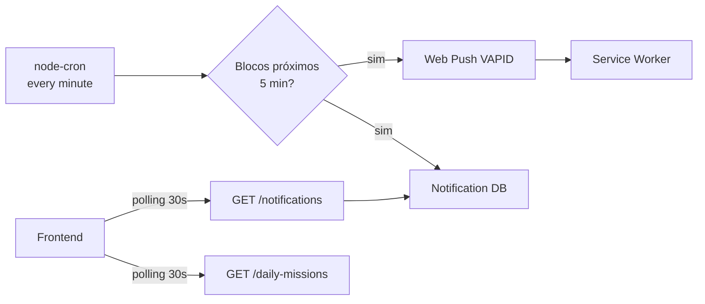

# Fluxos Assíncronos

## 1. Executive Summary
A aplicação usa dois mecanismos assíncronos: polling no frontend para atualizações em tempo real, e um scheduler `node-cron` no backend para push notifications e lembretes automáticos.

## 2. Key Takeaways
- **NotificationScheduler**: Job node-cron rodando a cada minuto no processo Express.
- **Web Push**: Notificações push reais via VAPID (web-push library).
- **Polling**: Frontend consulta notificações e missões periodicamente.
- Sem fila externa (Redis/RabbitMQ) — scheduler roda in-process.

## 3. System View / High-Level View

## 4. Detailed Analysis

### NotificationScheduler (`backend/src/services/NotificationScheduler.ts`)
- Iniciado no callback de `app.listen()` via `NotificationScheduler.start()`
- `cron.schedule("* * * * *", ...)` — verifica a cada minuto
- Busca blocos de rotina com `startTime` nos próximos 5 minutos
- Filtra blocos já completados (via `BlockCompletion`) e usuários com notificações desabilitadas
- Para cada bloco elegível:
  1. Envia Web Push para todas as PushSubscription ativas do usuário
  2. Cria registro `Notification` in-app
- Auto-desativa subscriptions expiradas (HTTP 410/404)

### Web Push (VAPID)
- Chaves VAPID configuradas via env vars (`VAPID_PUBLIC_KEY`, `VAPID_PRIVATE_KEY`)
- Endpoint público: `GET /api/v1/push/vapid-key` retorna a chave pública
- Frontend registra subscription via `POST /api/v1/notifications/subscribe`
- Payload: JSON com título, mensagem, ícone e URL de ação

### Frontend Polling
- `NotificationService`: polling de notificações a cada 30 segundos
- `DailyMissionsWidget`: polling de missões a cada 30 segundos
- Ambos usam `interval()` + `switchMap` com `takeUntilDestroyed`

### Fluxos sob demanda
- Geração de rotina: `POST /routine/generate` (síncrono, sob demanda)
- Geração de sugestão de refeições: `POST /scheduled-meals/generate`
- Insights do copilot: `GET /copilot/insights`

## 5. Evidence / File References
- `backend/src/services/NotificationScheduler.ts` — scheduler e push delivery
- `backend/src/controllers/NotificationController.ts` — subscribe, unsubscribe, preferences
- `backend/src/entities/PushSubscription.ts` — modelo de subscription
- `frontend/src/app/core/services/notification.service.ts` — polling + push registration
- `frontend/src/app/shared/components/daily-missions-widget.component.ts` — polling missões

## 6. Risks / Gaps / Unknowns
- Scheduler roda in-process — se o Express cair, lembretes param.
- Sem idempotência explícita em push delivery (possível duplicata em restart).
- Polling pode gerar carga desnecessária com muitos usuários simultâneos.

## 7. Recommendations
- Para escala, extrair scheduler para processo separado ou usar worker queue (Bull/BullMQ).
- Adicionar deduplicação baseada em hash (blockId + date + type).
- Considerar WebSocket/SSE para substituir polling no futuro.

## 8. Appendix
- Ver `operations/runbook.md` para procedimentos de restart.
