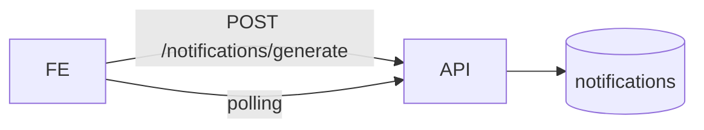

# Fluxos Assíncronos

## 1. Executive Summary
Fluxos assíncronos atuais são majoritariamente geração sob demanda e polling no frontend.

## 2. Key Takeaways
- Sem fila/worker dedicado confirmado.
- Notificações podem ser geradas via endpoint.

## 3. System View / High-Level View

## 4. Detailed Analysis
Polling periódico para widgets e geração de notificações orientada por requisição.

## 5. Evidence / File References
- `backend/src/controllers/NotificationController.ts`
- `frontend/src/app/shared/components/daily-missions-widget.component.ts`

## 6. Risks / Gaps / Unknowns
- Risco de carga e duplicidade sem idempotência robusta.

## 7. Recommendations
- Definir estratégia de jobs/filas para escala.

## 8. Appendix
- Ver `operations/runbook.md`.
