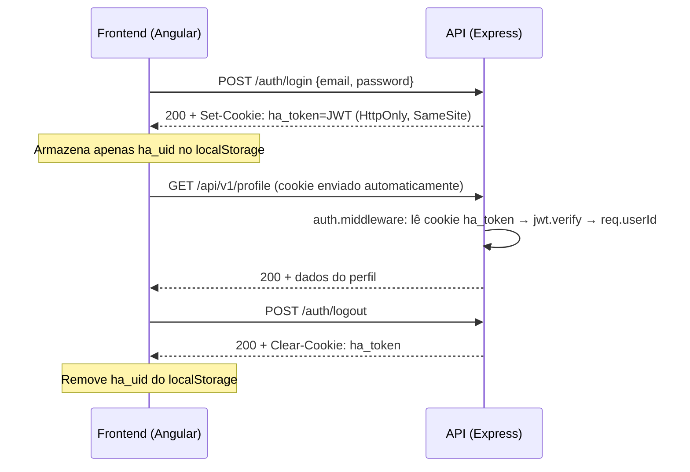

# Fluxo de Autenticação e Autorização

## 1. Executive Summary
A autenticação usa JWT armazenado em cookie HttpOnly (não mais localStorage). O middleware aceita cookie ou header Bearer como fallback. Logout limpa o cookie no servidor.

## 2. Key Takeaways
- Login gera JWT (`sub=userId`) e o seta como cookie HttpOnly `ha_token`.
- Frontend envia requests com `withCredentials: true` — o browser anexa o cookie automaticamente.
- Frontend armazena apenas `ha_uid` (user ID) em localStorage para lógica de UI.
- O interceptor Angular não injeta Bearer header — apenas trata 401 com auto-logout.
- Rotas protegidas passam por `authMiddleware` que extrai userId do JWT.

## 3. System View / High-Level View


## 4. Detailed Analysis

### Cookie Configuration
```typescript
// AuthController.ts
res.cookie("ha_token", token, {
  httpOnly: true,
  secure: isProduction,           // true em produção (HTTPS only)
  sameSite: isProduction ? "strict" : "lax",
  domain: env.cookieDomain,       // ex: .airafit.com
  maxAge: expiresInToMs(env.jwtExpiresIn),
  path: "/",
});
```

### Middleware de Autenticação
1. Tenta ler `req.cookies.ha_token`
2. Se não encontra, tenta `Authorization: Bearer <token>` (fallback para clientes API)
3. Verifica JWT com `jwt.verify(token, secret)`
4. Injeta `req.userId` para os controllers

### Frontend Auth Flow
- `AuthService.persist()`: salva apenas `ha_uid` no localStorage
- `AuthService.logout()`: chama `POST /auth/logout` + limpa localStorage
- `authInterceptor`: 401 → `authService.logout()` (sem injeção de header)
- `authGuard`: verifica `auth.userId` (não verifica token diretamente)

### Rate Limiting
- `/api/v1/auth/*`: 20 requests / 15 minutos (proteção brute-force)
- Resposta com headers `RateLimit-*` e `Retry-After`

## 5. Evidence / File References
- `backend/src/controllers/AuthController.ts` — login, register, logout + setTokenCookie
- `backend/src/middleware/auth.middleware.ts` — cookie + Bearer fallback
- `backend/src/app.ts` — authLimiter configuration
- `frontend/src/app/core/services/auth.service.ts` — persist, logout, token getter
- `frontend/src/app/core/interceptors/auth.interceptor.ts` — 401 handler
- `frontend/src/app/core/services/api.service.ts` — withCredentials: true

## 6. Risks / Gaps / Unknowns
- ~~Exposição de token por XSS em localStorage.~~ **RESOLVIDO**: Migrado para HttpOnly cookie.
- Não há refresh token — sessão expira com o JWT.
- Não há MFA opcional.
- Não há política de revogação centralizada (blacklist de tokens).

## 7. Recommendations
- Implementar refresh token rotation para sessões longas.
- Avaliar MFA opcional para usuários com dados clínicos sensíveis.
- Considerar token blacklist para revogação imediata em caso de comprometimento.

## 8. Appendix
- Ver `security/security-review.md` e `security/threat-model.md`.
