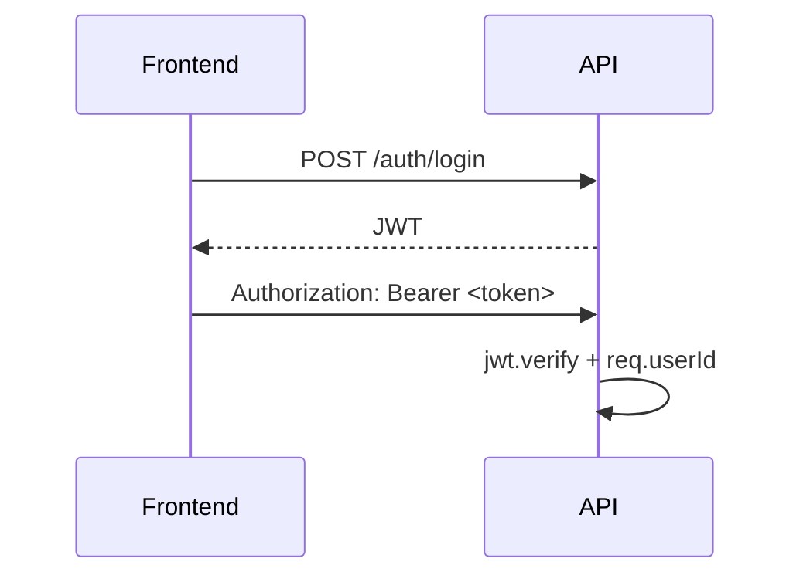

# Fluxo de Autenticação e Autorização

## 1. Executive Summary
Fluxo atual usa JWT Bearer do login até middleware de autorização.

## 2. Key Takeaways
- Login gera JWT (`sub=userId`).
- Frontend armazena token no localStorage.
- Rotas protegidas passam por `authMiddleware`.

## 3. System View / High-Level View

## 4. Detailed Analysis
Não há evidência de MFA, refresh token e política de revogação centralizada.

## 5. Evidence / File References
- `backend/src/controllers/AuthController.ts`
- `frontend/src/app/core/services/auth.service.ts`

## 6. Risks / Gaps / Unknowns
- Exposição de token por XSS em localStorage.

## 7. Recommendations
- Avaliar cookie HttpOnly + SameSite para sessão.

## 8. Appendix
- Ver `security/security-review.md`.
