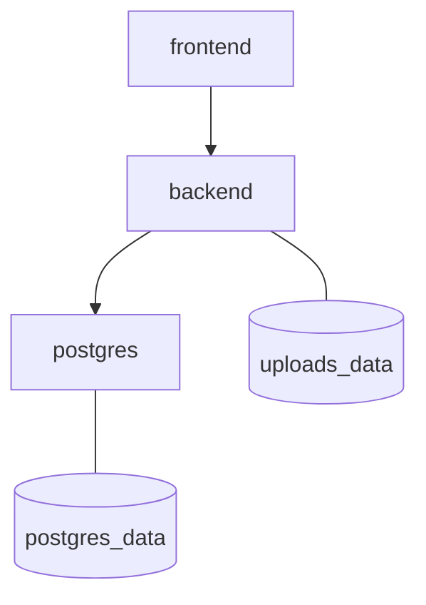

# C4 — Containers

## 1. Executive Summary
Descrição dos containers reais usados na aplicação.

## 2. Key Takeaways
- `frontend` (Nginx + assets Angular)
- `backend` (Node/Express)
- `postgres` (dados transacionais)

## 3. System View / High-Level View

## 4. Detailed Analysis
Variáveis de ambiente e conexão entre serviços são definidas no `docker-compose.yml`.

## 5. Evidence / File References
- `docker-compose.yml`
- `frontend/entrypoint.sh`

## 6. Risks / Gaps / Unknowns
- Segredos default em dev podem vazar para ambientes impróprios.

## 7. Recommendations
- Adotar secret manager e validação de startup para produção.

## 8. Appendix
- Ver `operations/environments.md`.
