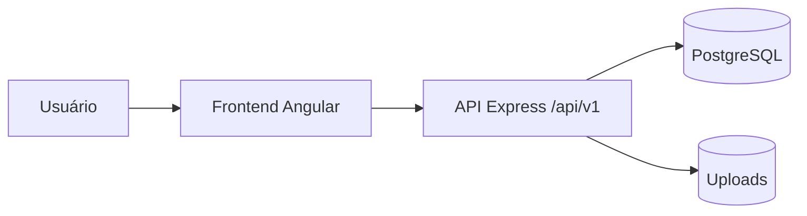

# C4 — Context

## 1. Executive Summary
Contexto do sistema AiraFit com usuários, frontend, backend e banco.

## 2. Key Takeaways
- Boundary crítico: navegador ↔ API.
- Boundary crítico: API ↔ banco com dados sensíveis.

## 3. System View / High-Level View

## 4. Detailed Analysis
- Usuário interage com SPA.
- SPA consome API com Bearer JWT.
- API persiste PHI/PII no PostgreSQL.

## 5. Evidence / File References
- `backend/src/middleware/auth.middleware.ts`
- `backend/src/entities/BloodTest.ts`

## 6. Risks / Gaps / Unknowns
- CORS e headers de segurança precisam hardening.

## 7. Recommendations
- Definir trust boundaries formais no threat model.

## 8. Appendix
- Ver `security/threat-model.md`.
