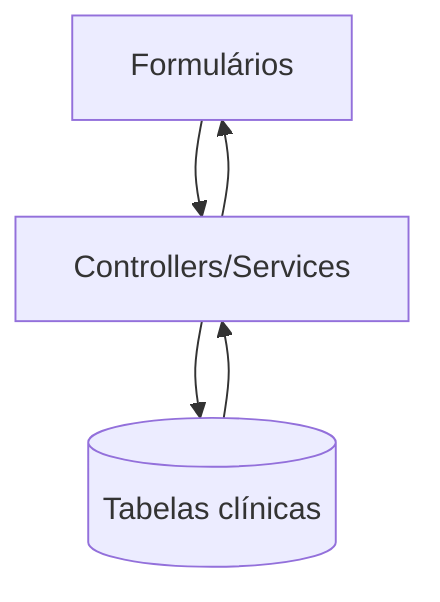

# Fluxo de Dados Sensíveis

## 1. Executive Summary
Dados de saúde são coletados no frontend, processados na API e armazenados no PostgreSQL.

## 2. Key Takeaways
- PHI presente em exames e perfil clínico.
- Necessário controlar minimização, retenção e auditoria.

## 3. System View / High-Level View

## 4. Detailed Analysis
Entidades críticas: `BloodTest`, `HealthProfile`, `WeeklyCheckIn`, `ClinicalProtocolLog`.

## 5. Evidence / File References
- `backend/src/entities/BloodTest.ts`
- `backend/src/entities/HealthProfile.ts`

## 6. Risks / Gaps / Unknowns
- Ausência de política explícita de retenção por categoria de dado.

## 7. Recommendations
- Criar inventário de dados e classificação formal.

## 8. Appendix
- Ver `privacy/data-inventory.md`.
