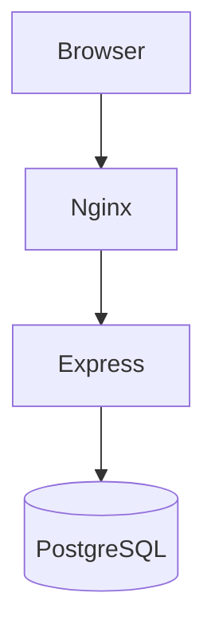

# Deployment e Infraestrutura

## 1. Executive Summary
Deploy atual usa Docker Compose com três serviços principais.

## 2. Key Takeaways
- Infra simples e funcional para ambientes iniciais.
- Necessário hardening para produção.

## 3. System View / High-Level View

## 4. Detailed Analysis
Ports, env vars e volumes são definidos em compose e Dockerfiles.

## 5. Evidence / File References
- `docker-compose.yml`
- `backend/Dockerfile`
- `frontend/Dockerfile`

## 6. Risks / Gaps / Unknowns
- Ausência de evidências de WAF, SIEM, secret manager e backup testado.

## 7. Recommendations
- Formalizar padrões por ambiente (dev/stg/prod).

## 8. Appendix
- Ver `operations/environments.md`.
