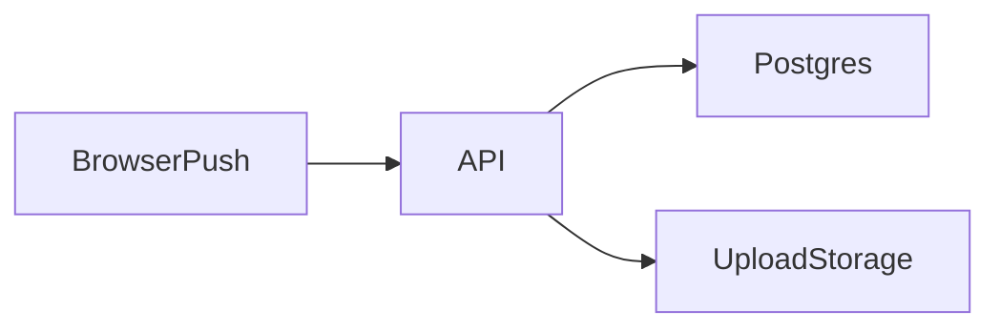

# Mapa de Integrações Externas

## 1. Executive Summary
Inventário de integrações e pontos de compartilhamento de dados.

## 2. Key Takeaways
- Integrações confirmadas: PostgreSQL e browser push subscription.
- Ausência de muitos terceiros explícitos no código atual.

## 3. System View / High-Level View

## 4. Detailed Analysis
Assinaturas de push são persistidas no backend para uso futuro.

## 5. Evidence / File References
- `backend/src/services/NotificationService.ts`
- `backend/src/entities/PushSubscription.ts`

## 6. Risks / Gaps / Unknowns
- Se novos terceiros entrarem, será necessário DPA e revisão de transferência internacional.

## 7. Recommendations
- Manter tabela viva de fornecedores e dados compartilhados.

## 8. Appendix
- Ver `privacy/lgpd-assessment.md`.
