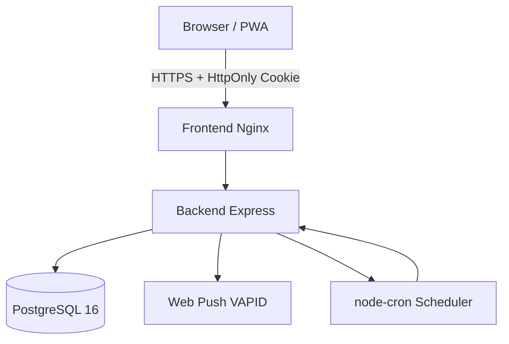

# Arquitetura — Overview

## 1. Executive Summary
AiraFit é um SaaS de saúde e wellness com frontend Angular 17 (PWA), backend Express/TypeScript e PostgreSQL. O backend concentra domínios clínicos, nutricionais, sociais e gamificação em uma API `/api/v1`. A aplicação inclui autenticação via JWT em HttpOnly cookies, segurança com Helmet/CORS/rate limiting, e notificações push via Web Push (VAPID).

## 2. Key Takeaways
- Arquitetura monolítica modular por domínio (36 entidades, 29 controllers, 20 services).
- Dados de saúde sensíveis (PHI) exigem controles fortes de privacidade e segurança — já implementados: HttpOnly JWT, Helmet, CORS restritivo, rate limiting.
- Fluxos principais: autenticação segura, coleta de dados clínicos, planejamento nutricional, rotina/treinos, gamificação social e notificações push.
- Frontend é PWA completa com service worker, suporte iOS, cache de API offline.

## 3. System View / High-Level View

- **Frontend**: Angular 17 + Nginx (standalone components, signals, OnPush, PWA).
- **Backend**: Express + TypeORM + Helmet + CORS + Rate Limiting + cookie-parser.
- **Dados**: PostgreSQL + storage local de uploads.
- **Push**: Web Push via VAPID com scheduler node-cron (minuto a minuto).

## 4. Detailed Analysis
### Módulos principais
- **Auth/Usuário**: Registro, login (HttpOnly cookie), logout, onboarding, avatar
- **Saúde Clínica**: Perfil de saúde, exames de sangue (24+ biomarcadores), check-ins semanais, hormônios
- **Nutrição**: Meals, recipes comunitárias, agendamento de refeições, protocolos clínicos, água
- **Rotina/Treinos**: Canvas de blocos diários, completions por data (BlockCompletion), fichas de treino (WorkoutSheet)
- **Social/Comunidade**: Feed, posts, likes, comments, amizades, grupos, desafios
- **Gamificação**: XP, ranking semanal, daily missions, challenges
- **Notificações**: In-app + Web Push (VAPID), scheduler de lembretes, preferências do usuário

### Segurança (implementada)
- JWT em cookie HttpOnly com SameSite strict em produção
- Helmet (CSP, HSTS, X-Frame-Options, X-Content-Type-Options)
- CORS restritivo por ambiente (`CORS_ORIGINS` env var)
- Rate limiting: auth 20/15min, API 200/min
- Senha hash com bcrypt

## 5. Evidence / File References
- `backend/src/app.ts` — Bootstrap com helmet, CORS, rate limiting, cookie-parser
- `backend/src/routes/index.ts` — Router central (~30 grupos de rotas)
- `backend/src/middleware/auth.middleware.ts` — JWT via cookie + Bearer fallback
- `backend/src/services/NotificationScheduler.ts` — Scheduler node-cron
- `frontend/src/app/app.routes.ts` — Rotas lazy-loaded com guards
- `frontend/src/manifest.webmanifest` — PWA manifest
- `frontend/ngsw-config.json` — Service worker com data caching

## 6. Risks / Gaps / Unknowns
- ~~Sessão em localStorage.~~ **RESOLVIDO** (Sprint 1-2): Migrado para HttpOnly cookies.
- ~~CORS permissivo.~~ **RESOLVIDO** (Sprint 1-2): Whitelist por ambiente.
- ~~Sem rate limiting.~~ **RESOLVIDO** (Sprint 1-2): Auth + API limiters.
- Ausência de política formal de retenção em código (planejado Sprint 11-12).
- MFA e refresh tokens ainda não implementados.
- Auditoria formal de acesso a PHI pendente.

## 7. Recommendations
- Implementar refresh tokens para sessões longas.
- Adicionar auditoria de acesso a PHI (Sprint 11-12).
- Formalizar LGPD compliance com retenção automática (Sprint 11-12).
- Adicionar testes automatizados (unit + e2e) (Sprint 11-12).

## 8. Appendix
- Ver também: `c4-context.md`, `modules.md`, `data-flow.md`, `auth-flow.md`.
- Contexto completo: `CLAUDE_CONTEXT.md`.
