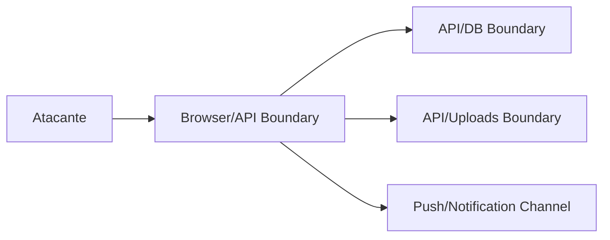

# Threat Model

## 1. Executive Summary
Modelo de ameaças para ativos críticos: credenciais, dados clínicos e dados sociais. Atualizado com controles implementados nas Sprints 1-2.

## 2. Key Takeaways
- Ativos de maior valor: PHI + credenciais + sessão.
- Fronteiras críticas: browser/API, API/DB, API/uploads.
- Superfície de ataque reduzida com HttpOnly cookies, Helmet, CORS e rate limiting.

## 3. System View / High-Level View

## 4. Detailed Analysis

### Vetores de Ataque
| Vetor                | Risco   | Controles Implementados                       | Status   |
| -------------------- | ------- | --------------------------------------------- | -------- |
| Account takeover     | Alto    | bcrypt, rate limit 20/15min, HttpOnly JWT      | ✅ Mitigado |
| XSS → roubo de sessão | Alto  | HttpOnly cookie (inacessível via JS), CSP      | ✅ Mitigado |
| CSRF                 | Médio   | SameSite strict, CORS restritivo               | ✅ Mitigado |
| IDOR/BOLA            | Alto    | Filtro por `userId` em todas as queries         | ⚠️ Sem auditoria formal |
| Exfiltração de PHI   | Crítico | Filtro por userId, CORS, rate limit             | ⚠️ Sem auditoria de acesso |
| Brute force          | Alto    | Rate limiting 20/15min                          | ✅ Mitigado |
| Abuse de upload      | Médio   | Validação básica de tipo                        | ⚠️ Validação superficial |
| Push notification spam | Baixo | Scheduler com deduplicação por bloco/data       | ✅ Mitigado |

### Controles Implementados (Sprint 1-2)
- **JWT HttpOnly**: Token inacessível via JavaScript, elimina vetor XSS→session theft
- **SameSite strict**: Previne CSRF em produção
- **Helmet**: CSP bloqueia inline scripts, HSTS força HTTPS, X-Frame-Options previne clickjacking
- **CORS whitelist**: Apenas origens autorizadas podem fazer requests
- **Rate limiting**: Proteção contra brute force e abuse

### Controles Pendentes
- Auditoria de acesso a PHI (quem acessou quais dados, quando)
- Validação robusta de uploads (magic bytes, scanning)
- MFA opcional
- Monitoramento de anomalias (logins suspeitos, acesso massivo)

## 5. Evidence / File References
- `backend/src/middleware/auth.middleware.ts` — autenticação
- `backend/src/app.ts` — helmet, CORS, rate limiting
- `backend/src/controllers/AuthController.ts` — HttpOnly cookie config
- `backend/src/services/MealService.ts` — exemplo de filtro por userId

## 6. Risks / Gaps / Unknowns
- Sem evidência de trilha de auditoria clínica detalhada.
- Pen test ainda não realizado.
- IDOR depende de checagem manual em cada endpoint.

## 7. Recommendations
- Pen test focado em IDOR/BOLA antes do go-live.
- Implementar logging de acesso a PHI.
- Formalizar modelo STRIDE por fluxo crítico.

## 8. Appendix
- Ver `security-checklist.md` e `remediation-backlog.md`.
