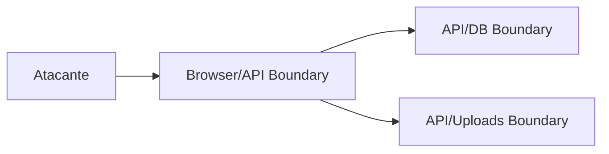

# Threat Model

## 1. Executive Summary
Modelo de ameaças para ativos críticos: credenciais, dados clínicos e dados sociais.

## 2. Key Takeaways
- Ativos de maior valor: PHI + credenciais + token de sessão.
- Fronteiras críticas: browser/API, API/DB, API/uploads.

## 3. System View / High-Level View

## 4. Detailed Analysis
### Vetores
- Account takeover
- IDOR/BOLA
- Exfiltração de PHI
- Abuse de upload

### Controles atuais
- JWT + filtros por `userId`
- Hash de senha com bcrypt

### Controles ausentes/recomendados
- Rate limiting, MFA opcional, auditoria de acesso a PHI.

## 5. Evidence / File References
- `backend/src/middleware/auth.middleware.ts`
- `backend/src/services/MealService.ts`

## 6. Risks / Gaps / Unknowns
- Sem evidência de trilha de auditoria clínica detalhada.

## 7. Recommendations
- Formalizar modelo STRIDE por fluxo crítico.

## 8. Appendix
- Ver `security-checklist.md`.
